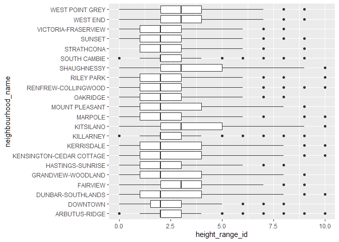
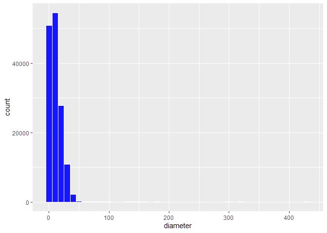
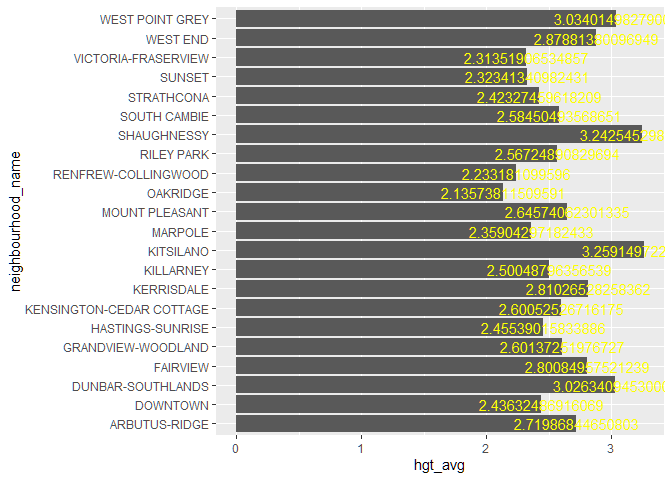
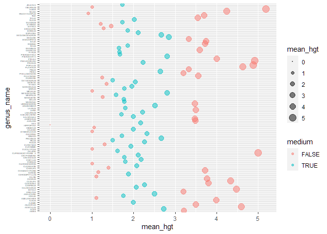

Mini Data-Analysis Deliverable 1
================

# Welcome to your part 1 data analysis project!

And hopefully the first of many. Let’s get started:

1.  Install the [`datateachr`](https://github.com/UBC-MDS/datateachr)
    package by typing the following into your **R terminal**:

<!-- -->

    install.packages("devtools")
    devtools::install_github("UBC-MDS/datateachr")

2.  Load the packages below.

``` r
library(datateachr)
library(tidyverse)
```

    ## ── Attaching packages ─────────────────────────────────────── tidyverse 1.3.2 ──
    ## ✔ ggplot2 3.3.6      ✔ purrr   0.3.5 
    ## ✔ tibble  3.1.8      ✔ dplyr   1.0.10
    ## ✔ tidyr   1.2.1      ✔ stringr 1.4.1 
    ## ✔ readr   2.1.3      ✔ forcats 0.5.2 
    ## ── Conflicts ────────────────────────────────────────── tidyverse_conflicts() ──
    ## ✖ dplyr::filter() masks stats::filter()
    ## ✖ dplyr::lag()    masks stats::lag()

3.  Make a repository in the <https://github.com/stat545ubc-2022>
    Organization. You will be working with this repository for the
    entire data analysis project. You can either make it public, or make
    it private and add the TA’s and Lucy as collaborators. A link to
    help you create a private repository is available on the
    \#collaborative-project Slack channel.

# Instructions

## For Both Milestones

- Each milestone is worth 45 points. The number of points allocated to
  each task will be annotated within each deliverable. Tasks that are
  more challenging will often be allocated more points.

- 10 points will be allocated to the reproducibility, cleanliness, and
  coherence of the overall analysis. While the two milestones will be
  submitted as independent deliverables, the analysis itself is a
  continuum - think of it as two chapters to a story. Each chapter, or
  in this case, portion of your analysis, should be easily followed
  through by someone unfamiliar with the content.
  [Here](https://swcarpentry.github.io/r-novice-inflammation/06-best-practices-R/)
  is a good resource for what constitutes “good code”. Learning good
  coding practices early in your career will save you hassle later on!

## For Milestone 1

**To complete this milestone**, edit [this very `.Rmd`
file](https://raw.githubusercontent.com/UBC-STAT/stat545.stat.ubc.ca/master/content/mini-project/mini-project-1.Rmd)
directly. Fill in the sections that are tagged with
`<!--- start your work below --->`.

**To submit this milestone**, make sure to knit this `.Rmd` file to an
`.md` file by changing the YAML output settings from
`output: html_document` to `output: github_document`. Commit and push
all of your work to the mini-analysis GitHub repository you made
earlier, and tag a release on GitHub. Then, submit a link to your tagged
release on canvas.

**Points**: This milestone is worth 45 points: 43 for your analysis, 1
point for having your Milestone 1 document knit error-free, and 1 point
for tagging your release on Github.

# Learning Objectives

By the end of this milestone, you should:

- Become familiar with your dataset of choosing
- Select 4 questions that you would like to answer with your data
- Generate a reproducible and clear report using R Markdown
- Become familiar with manipulating and summarizing your data in tibbles
  using `dplyr`, with a research question in mind.

# Task 1: Choose your favorite dataset (10 points)

The `datateachr` package by Hayley Boyce and Jordan Bourak currently
composed of 7 semi-tidy datasets for educational purposes. Here is a
brief description of each dataset:

- *apt_buildings*: Acquired courtesy of The City of Toronto’s Open Data
  Portal. It currently has 3455 rows and 37 columns.

- *building_permits*: Acquired courtesy of The City of Vancouver’s Open
  Data Portal. It currently has 20680 rows and 14 columns.

- *cancer_sample*: Acquired courtesy of UCI Machine Learning Repository.
  It currently has 569 rows and 32 columns.

- *flow_sample*: Acquired courtesy of The Government of Canada’s
  Historical Hydrometric Database. It currently has 218 rows and 7
  columns.

- *parking_meters*: Acquired courtesy of The City of Vancouver’s Open
  Data Portal. It currently has 10032 rows and 22 columns.

- *steam_games*: Acquired courtesy of Kaggle. It currently has 40833
  rows and 21 columns.

- *vancouver_trees*: Acquired courtesy of The City of Vancouver’s Open
  Data Portal. It currently has 146611 rows and 20 columns.

**Things to keep in mind**

- We hope that this project will serve as practice for carrying our your
  own *independent* data analysis. Remember to comment your code, be
  explicit about what you are doing, and write notes in this markdown
  document when you feel that context is required. As you advance in the
  project, prompts and hints to do this will be diminished - it’ll be up
  to you!

- Before choosing a dataset, you should always keep in mind **your
  goal**, or in other ways, *what you wish to achieve with this data*.
  This mini data-analysis project focuses on *data wrangling*,
  *tidying*, and *visualization*. In short, it’s a way for you to get
  your feet wet with exploring data on your own.

And that is exactly the first thing that you will do!

1.1 Out of the 7 datasets available in the `datateachr` package, choose
**4** that appeal to you based on their description. Write your choices
below:

**Note**: We encourage you to use the ones in the `datateachr` package,
but if you have a dataset that you’d really like to use, you can include
it here. But, please check with a member of the teaching team to see
whether the dataset is of appropriate complexity. Also, include a
**brief** description of the dataset here to help the teaching team
understand your data.

<!-------------------------- Start your work below ---------------------------->

``` html
1: "cancer_sample"
2: "parking_meters"
3: "vancouver_trees"
4: "flow_sample"
```

<!----------------------------------------------------------------------------->

1.2 One way to narrowing down your selection is to *explore* the
datasets. Use your knowledge of dplyr to find out at least *3*
attributes about each of these datasets (an attribute is something such
as number of rows, variables, class type…). The goal here is to have an
idea of *what the data looks like*.

*Hint:* This is one of those times when you should think about the
cleanliness of your analysis. I added a single code chunk for you below,
but do you want to use more than one? Would you like to write more
comments outside of the code chunk?

<!-------------------------- Start your work below ---------------------------->

``` r
fourchoices <- lapply(list(cancer_sample, parking_meters, vancouver_trees, flow_sample), glimpse)
```

``` r
head(fourchoices)
```

    ## [[1]]
    ## # A tibble: 569 × 32
    ##          ID diagnosis radius_m…¹ textu…² perim…³ area_…⁴ smoot…⁵ compa…⁶ conca…⁷
    ##       <dbl> <chr>          <dbl>   <dbl>   <dbl>   <dbl>   <dbl>   <dbl>   <dbl>
    ##  1   842302 M               18.0    10.4   123.    1001   0.118   0.278   0.300 
    ##  2   842517 M               20.6    17.8   133.    1326   0.0847  0.0786  0.0869
    ##  3 84300903 M               19.7    21.2   130     1203   0.110   0.160   0.197 
    ##  4 84348301 M               11.4    20.4    77.6    386.  0.142   0.284   0.241 
    ##  5 84358402 M               20.3    14.3   135.    1297   0.100   0.133   0.198 
    ##  6   843786 M               12.4    15.7    82.6    477.  0.128   0.17    0.158 
    ##  7   844359 M               18.2    20.0   120.    1040   0.0946  0.109   0.113 
    ##  8 84458202 M               13.7    20.8    90.2    578.  0.119   0.164   0.0937
    ##  9   844981 M               13      21.8    87.5    520.  0.127   0.193   0.186 
    ## 10 84501001 M               12.5    24.0    84.0    476.  0.119   0.240   0.227 
    ## # … with 559 more rows, 23 more variables: concave_points_mean <dbl>,
    ## #   symmetry_mean <dbl>, fractal_dimension_mean <dbl>, radius_se <dbl>,
    ## #   texture_se <dbl>, perimeter_se <dbl>, area_se <dbl>, smoothness_se <dbl>,
    ## #   compactness_se <dbl>, concavity_se <dbl>, concave_points_se <dbl>,
    ## #   symmetry_se <dbl>, fractal_dimension_se <dbl>, radius_worst <dbl>,
    ## #   texture_worst <dbl>, perimeter_worst <dbl>, area_worst <dbl>,
    ## #   smoothness_worst <dbl>, compactness_worst <dbl>, concavity_worst <dbl>, …
    ## 
    ## [[2]]
    ## # A tibble: 10,032 × 22
    ##    meter_head  r_mf_9a…¹ r_mf_…² r_sa_…³ r_sa_…⁴ r_su_…⁵ r_su_…⁶ rate_…⁷ time_…⁸
    ##    <chr>       <chr>     <chr>   <chr>   <chr>   <chr>   <chr>   <chr>   <chr>  
    ##  1 Twin        $2.00     $4.00   $2.00   $4.00   $2.00   $4.00   <NA>    METER …
    ##  2 Pay Station $1.00     $1.00   $1.00   $1.00   $1.00   $1.00   $ .50   METER …
    ##  3 Twin        $1.00     $1.00   $1.00   $1.00   $1.00   $1.00   <NA>    METER …
    ##  4 Single      $1.00     $1.00   $1.00   $1.00   $1.00   $1.00   <NA>    METER …
    ##  5 Twin        $2.00     $1.00   $2.00   $1.00   $2.00   $1.00   <NA>    METER …
    ##  6 Twin        $2.00     $1.00   $2.00   $1.00   $2.00   $1.00   <NA>    METER …
    ##  7 Twin        $2.00     $3.00   $2.00   $3.00   $2.00   $3.00   <NA>    METER …
    ##  8 Single      $2.00     $3.00   $2.00   $3.00   $2.00   $3.00   <NA>    METER …
    ##  9 Twin        $4.00     $1.00   $4.00   $1.00   $4.00   $1.00   <NA>    METER …
    ## 10 Twin        $2.00     $1.00   $2.00   $1.00   $2.00   $1.00   <NA>    METER …
    ## # … with 10,022 more rows, 13 more variables: t_mf_9a_6p <chr>,
    ## #   t_mf_6p_10 <chr>, t_sa_9a_6p <chr>, t_sa_6p_10 <chr>, t_su_9a_6p <chr>,
    ## #   t_su_6p_10 <chr>, time_misc <chr>, credit_card <chr>, pay_phone <chr>,
    ## #   longitude <dbl>, latitude <dbl>, geo_local_area <chr>, meter_id <chr>, and
    ## #   abbreviated variable names ¹​r_mf_9a_6p, ²​r_mf_6p_10, ³​r_sa_9a_6p,
    ## #   ⁴​r_sa_6p_10, ⁵​r_su_9a_6p, ⁶​r_su_6p_10, ⁷​rate_misc, ⁸​time_in_effect
    ## 
    ## [[3]]
    ## # A tibble: 146,611 × 20
    ##    tree_id civic_number std_st…¹ genus…² speci…³ culti…⁴ commo…⁵ assig…⁶ root_…⁷
    ##      <dbl>        <dbl> <chr>    <chr>   <chr>   <chr>   <chr>   <chr>   <chr>  
    ##  1  149556          494 W 58TH … ULMUS   AMERIC… BRANDON BRANDO… N       N      
    ##  2  149563          450 W 58TH … ZELKOVA SERRATA <NA>    JAPANE… N       N      
    ##  3  149579         4994 WINDSOR… STYRAX  JAPONI… <NA>    JAPANE… N       N      
    ##  4  149590          858 E 39TH … FRAXIN… AMERIC… AUTUMN… AUTUMN… Y       N      
    ##  5  149604         5032 WINDSOR… ACER    CAMPES… <NA>    HEDGE … N       N      
    ##  6  149616          585 W 61ST … PYRUS   CALLER… CHANTI… CHANTI… N       N      
    ##  7  149617         4909 SHERBRO… ACER    PLATAN… COLUMN… COLUMN… N       N      
    ##  8  149618         4925 SHERBRO… ACER    PLATAN… COLUMN… COLUMN… N       N      
    ##  9  149619         4969 SHERBRO… ACER    PLATAN… COLUMN… COLUMN… N       N      
    ## 10  149625          720 E 39TH … FRAXIN… AMERIC… AUTUMN… AUTUMN… N       N      
    ## # … with 146,601 more rows, 11 more variables: plant_area <chr>,
    ## #   on_street_block <dbl>, on_street <chr>, neighbourhood_name <chr>,
    ## #   street_side_name <chr>, height_range_id <dbl>, diameter <dbl>, curb <chr>,
    ## #   date_planted <date>, longitude <dbl>, latitude <dbl>, and abbreviated
    ## #   variable names ¹​std_street, ²​genus_name, ³​species_name, ⁴​cultivar_name,
    ## #   ⁵​common_name, ⁶​assigned, ⁷​root_barrier
    ## 
    ## [[4]]
    ## # A tibble: 218 × 7
    ##    station_id  year extreme_type month   day  flow sym  
    ##    <chr>      <dbl> <chr>        <dbl> <dbl> <dbl> <chr>
    ##  1 05BB001     1909 maximum          7     7   314 <NA> 
    ##  2 05BB001     1910 maximum          6    12   230 <NA> 
    ##  3 05BB001     1911 maximum          6    14   264 <NA> 
    ##  4 05BB001     1912 maximum          8    25   174 <NA> 
    ##  5 05BB001     1913 maximum          6    11   232 <NA> 
    ##  6 05BB001     1914 maximum          6    18   214 <NA> 
    ##  7 05BB001     1915 maximum          6    27   236 <NA> 
    ##  8 05BB001     1916 maximum          6    20   309 <NA> 
    ##  9 05BB001     1917 maximum          6    17   174 <NA> 
    ## 10 05BB001     1918 maximum          6    15   345 <NA> 
    ## # … with 208 more rows

> As it is demonstrated above, these 4 datasets are all in tibble
> format:  
> 1- **“cancer_sample”** is in 569 rows and 32 columns.  
> 2- **parking_meters”** is in 10032 rows and 22 columns.  
> 3- **“vancouver_trees”** is in 146611 rows and 20 columns.  
> 4- **“flow_sample”** is in 218 rows and 7 columns.  
> , each row is an observation and each column is a variable.

<!----------------------------------------------------------------------------->

1.3 Now that you’ve explored the 4 datasets that you were initially most
interested in, let’s narrow it down to 2. What lead you to choose these
2? Briefly explain your choices below, and feel free to include any code
in your explanation.

<!-------------------------- Start your work below ---------------------------->

> **“cancer_sample”** and **“vancouver_trees”** are my choices as they
> seem to be the most diverse datasets, as their dimension is larger in
> comparison with other datasets.  
> Note: I tried to hide the r console thorugh echo=F or message=F, but
> it did not work.

``` r
dim(cancer_sample)
```

    ## [1] 569  32

``` r
dim(vancouver_trees)
```

    ## [1] 146611     20

  
<!----------------------------------------------------------------------------->

1.4 Time for the final decision! Going back to the beginning, it’s
important to have an *end goal* in mind. For example, if I had chosen
the `titanic` dataset for my project, I might’ve wanted to explore the
relationship between survival and other variables. Try to think of 1
research question that you would want to answer with each dataset. Note
them down below, and make your final choice based on what seems more
interesting to you!

<!-------------------------- Start your work below ---------------------------->

> I would choose **“vancouver_trees”** as my final choice. Below you can
> see an initial domenstration of relation between neighborhood and mean
> of tree diameters.

``` r
neigh_dia <- vancouver_trees %>% 
  group_by(neighbourhood_name) %>% 
  summarise(mean(diameter))
colnames(neigh_dia) <- c("neighborhood", "mdiameter")
arrange(neigh_dia, desc(mdiameter))
```

    ## # A tibble: 22 × 2
    ##    neighborhood             mdiameter
    ##    <chr>                        <dbl>
    ##  1 KITSILANO                     14.4
    ##  2 SHAUGHNESSY                   14.3
    ##  3 DUNBAR-SOUTHLANDS             13.9
    ##  4 WEST POINT GREY               13.2
    ##  5 KERRISDALE                    12.7
    ##  6 WEST END                      12.1
    ##  7 ARBUTUS-RIDGE                 11.9
    ##  8 RILEY PARK                    11.8
    ##  9 SOUTH CAMBIE                  11.7
    ## 10 KENSINGTON-CEDAR COTTAGE      11.7
    ## # … with 12 more rows

  
<!----------------------------------------------------------------------------->

# Important note

Read Tasks 2 and 3 *fully* before starting to complete either of them.
Probably also a good point to grab a coffee to get ready for the fun
part!

This project is semi-guided, but meant to be *independent*. For this
reason, you will complete tasks 2 and 3 below (under the **START HERE**
mark) as if you were writing your own exploratory data analysis report,
and this guidance never existed! Feel free to add a brief introduction
section to your project, format the document with markdown syntax as you
deem appropriate, and structure the analysis as you deem appropriate.
Remember, marks will be awarded for completion of the 4 tasks, but 10
points of the whole project are allocated to a reproducible and clean
analysis. If you feel lost, you can find a sample data analysis
[here](https://www.kaggle.com/headsortails/tidy-titarnic) to have a
better idea. However, bear in mind that it is **just an example** and
you will not be required to have that level of complexity in your
project.  

> **This is a preliminary expletory analysis of collected data from
> trees in vancouver. This dataset is accessible by calling “datateachr”
> package.**  

# Task 2: Exploring your dataset (15 points)

If we rewind and go back to the learning objectives, you’ll see that by
the end of this deliverable, you should have formulated *4* research
questions about your data that you may want to answer during your
project. However, it may be handy to do some more exploration on your
dataset of choice before creating these questions - by looking at the
data, you may get more ideas. **Before you start this task, read all
instructions carefully until you reach START HERE under Task 3**.

2.1 Complete *4 out of the following 8 exercises* to dive deeper into
your data. All datasets are different and therefore, not all of these
tasks may make sense for your data - which is why you should only answer
*4*. Use *dplyr* and *ggplot*.

1.  Plot the distribution of a numeric variable.
2.  Create a new variable based on other variables in your data (only if
    it makes sense)
3.  Investigate how many missing values there are per variable. Can you
    find a way to plot this?
4.  Explore the relationship between 2 variables in a plot.
5.  Filter observations in your data according to your own criteria.
    Think of what you’d like to explore - again, if this was the
    `titanic` dataset, I may want to narrow my search down to passengers
    born in a particular year…
6.  Use a boxplot to look at the frequency of different observations
    within a single variable. You can do this for more than one variable
    if you wish!
7.  Make a new tibble with a subset of your data, with variables and
    observations that you are interested in exploring.
8.  Use a density plot to explore any of your variables (that are
    suitable for this type of plot).

2.2 For each of the 4 exercises that you complete, provide a *brief
explanation* of why you chose that exercise in relation to your data (in
other words, why does it make sense to do that?), and sufficient
comments for a reader to understand your reasoning and code.

<!-------------------------- Start your work below ---------------------------->

``` r
# Exercise 1: Plotting the distribution of trees height in each neighborhood gives an insight to areas that are more populated.

vancouver_trees %>%
  ggplot(aes(neighbourhood_name, height_range_id)) +
  geom_boxplot() +
  coord_flip()
```

<!-- -->

``` r
# As it is shown, trees above 7.5 range id are very rare in most of neighborhoods.
```

``` r
# Exercise 2: Trying to find missing values across the dataset. 

vtrees.na <- vancouver_trees %>%
  select(everything()) %>%
  summarise_all(funs(sum(is.na(.))))
```

    ## Warning: `funs()` was deprecated in dplyr 0.8.0.
    ## ℹ Please use a list of either functions or lambdas:
    ## 
    ## # Simple named list: list(mean = mean, median = median)
    ## 
    ## # Auto named with `tibble::lst()`: tibble::lst(mean, median)
    ## 
    ## # Using lambdas list(~ mean(., trim = .2), ~ median(., na.rm = TRUE))

``` r
print(vtrees.na)
```

    ## # A tibble: 1 × 20
    ##   tree_id civic_number std_str…¹ genus…² speci…³ culti…⁴ commo…⁵ assig…⁶ root_…⁷
    ##     <int>        <int>     <int>   <int>   <int>   <int>   <int>   <int>   <int>
    ## 1       0            0         0       0       0   67559       0       0       0
    ## # … with 11 more variables: plant_area <int>, on_street_block <int>,
    ## #   on_street <int>, neighbourhood_name <int>, street_side_name <int>,
    ## #   height_range_id <int>, diameter <int>, curb <int>, date_planted <int>,
    ## #   longitude <int>, latitude <int>, and abbreviated variable names
    ## #   ¹​std_street, ²​genus_name, ³​species_name, ⁴​cultivar_name, ⁵​common_name,
    ## #   ⁶​assigned, ⁷​root_barrier

``` r
# Exercise 7: Making a subset tibble from the dataset of location and planting date of trees.

date.loc <- vancouver_trees %>%
  select(tree_id, date_planted:latitude)
head(date.loc)
```

    ## # A tibble: 6 × 4
    ##   tree_id date_planted longitude latitude
    ##     <dbl> <date>           <dbl>    <dbl>
    ## 1  149556 1999-01-13       -123.     49.2
    ## 2  149563 1996-05-31       -123.     49.2
    ## 3  149579 1993-11-22       -123.     49.2
    ## 4  149590 1996-04-29       -123.     49.2
    ## 5  149604 1993-12-17       -123.     49.2
    ## 6  149616 NA               -123.     49.2

``` r
# Exercise 8: Exploring a diameter density.

vancouver_trees %>%
ggplot( aes(diameter)) +
    geom_histogram( binwidth=10, fill="blue", color="white", alpha=0.9)
```

<!-- -->

<!----------------------------------------------------------------------------->

# Task 3: Write your research questions (5 points)

So far, you have chosen a dataset and gotten familiar with it through
exploring the data. Now it’s time to figure out 4 research questions
that you would like to answer with your data! Write the 4 questions and
any additional comments at the end of this deliverable. These questions
are not necessarily set in stone - TAs will review them and give you
feedback; therefore, you may choose to pursue them as they are for the
rest of the project, or make modifications!

``` html
Question 1: Which neighborhood has tallest trees in avarage?
Question 2: Is there a relationship between genus and height?
Question 3: In each year, which neighborhood had the most planted trees?
Question 4: If presume height index bigger than 3.5 as tall, is there a relation between root barrier and height of the tree?
```

<!--- *****START HERE***** --->

# Task 4: Process and summarize your data (13 points)

From Task 2, you should have an idea of the basic structure of your
dataset (e.g. number of rows and columns, class types, etc.). Here, we
will start investigating your data more in-depth using various data
manipulation functions.

### 1.1 (10 points)

Now, for each of your four research questions, choose one task from
options 1-4 (summarizing), and one other task from 4-8 (graphing). You
should have 2 tasks done for each research question (8 total). Make sure
it makes sense to do them! (e.g. don’t use a numerical variables for a
task that needs a categorical variable.). Comment on why each task helps
(or doesn’t!) answer the corresponding research question.

Ensure that the output of each operation is printed!

**Summarizing:**

1.  Compute the *range*, *mean*, and *two other summary statistics* of
    **one numerical variable** across the groups of **one categorical
    variable** from your data.
2.  Compute the number of observations for at least one of your
    categorical variables. Do not use the function `table()`!
3.  Create a categorical variable with 3 or more groups from an existing
    numerical variable. You can use this new variable in the other
    tasks! *An example: age in years into “child, teen, adult, senior”.*
4.  Based on two categorical variables, calculate two summary statistics
    of your choosing.

**Graphing:**

5.  Create a graph out of summarized variables that has at least two
    geom layers.
6.  Create a graph of your choosing, make one of the axes logarithmic,
    and format the axes labels so that they are “pretty” or easier to
    read.
7.  Make a graph where it makes sense to customize the alpha
    transparency.
8.  Create 3 histograms out of summarized variables, with each histogram
    having different sized bins. Pick the “best” one and explain why it
    is the best.

Make sure it’s clear what research question you are doing each operation
for!

<!------------------------- Start your work below ----------------------------->

# Question 1

**Which neighborhood has tallest trees in avarage?**

``` r
#summarizing
tall_tree <- vancouver_trees %>%
  group_by(neighbourhood_name) %>%
  summarise(hgt_avg = mean(height_range_id)) %>%
  arrange(desc(hgt_avg))
print(tall_tree)
```

    ## # A tibble: 22 × 2
    ##    neighbourhood_name hgt_avg
    ##    <chr>                <dbl>
    ##  1 KITSILANO             3.26
    ##  2 SHAUGHNESSY           3.24
    ##  3 WEST POINT GREY       3.03
    ##  4 DUNBAR-SOUTHLANDS     3.03
    ##  5 WEST END              2.88
    ##  6 KERRISDALE            2.81
    ##  7 FAIRVIEW              2.80
    ##  8 ARBUTUS-RIDGE         2.72
    ##  9 MOUNT PLEASANT        2.65
    ## 10 GRANDVIEW-WOODLAND    2.60
    ## # … with 12 more rows

``` r
#compute the number of observations for at least one of your categorical variables.
taller_2.6 <- tall_tree %>%
  filter(hgt_avg >= 2.6)
print(taller_2.6)
```

    ## # A tibble: 11 × 2
    ##    neighbourhood_name       hgt_avg
    ##    <chr>                      <dbl>
    ##  1 KITSILANO                   3.26
    ##  2 SHAUGHNESSY                 3.24
    ##  3 WEST POINT GREY             3.03
    ##  4 DUNBAR-SOUTHLANDS           3.03
    ##  5 WEST END                    2.88
    ##  6 KERRISDALE                  2.81
    ##  7 FAIRVIEW                    2.80
    ##  8 ARBUTUS-RIDGE               2.72
    ##  9 MOUNT PLEASANT              2.65
    ## 10 GRANDVIEW-WOODLAND          2.60
    ## 11 KENSINGTON-CEDAR COTTAGE    2.60

``` r
#number of neighbourhoods with avarge tree heigt greater than 2.6
length(row.names(taller_2.6))
```

    ## [1] 11

``` r
#graphing
#create a graph out of summarized variables that has at least two geom layers.

tall_tree %>%
  ggplot(aes(neighbourhood_name ,hgt_avg)) +
  geom_bar(stat = "identity") +
  geom_text(aes(label = hgt_avg), color = "yellow") +
  coord_flip()
```

<!-- -->

# Question 2

**Is there a relationship between genus and height?**

``` r
#summarizing
dia_hgt <- vancouver_trees %>%
  summarise(genus_name, height_range_id) %>%
  group_by(genus_name) %>%
  summarise(mean_hgt = mean(height_range_id)) %>%
  arrange(desc(mean_hgt))
  print(dia_hgt)
```

    ## # A tibble: 97 × 2
    ##    genus_name          mean_hgt
    ##    <chr>                  <dbl>
    ##  1 ULMUS                   5.18
    ##  2 CUPRESSOCYPARIS   X     5   
    ##  3 PSEUDOTSUGA             4.92
    ##  4 POPULUS                 4.88
    ##  5 PLATANUS                4.63
    ##  6 AESCULUS                4.60
    ##  7 BETULA                  4.48
    ##  8 CATALPA                 4.34
    ##  9 TSUGA                   4.25
    ## 10 PTELEA                  4   
    ## # … with 87 more rows

``` r
#Create a categorical variable with 3 or more groups from an existing numerical variable.
dia_hgt <- dia_hgt %>%
  mutate(tall = mean_hgt > 3, medium = between(mean_hgt,1.5,3), short = between(mean_hgt,0,1.5))

print(dia_hgt)
```

    ## # A tibble: 97 × 5
    ##    genus_name          mean_hgt tall  medium short
    ##    <chr>                  <dbl> <lgl> <lgl>  <lgl>
    ##  1 ULMUS                   5.18 TRUE  FALSE  FALSE
    ##  2 CUPRESSOCYPARIS   X     5    TRUE  FALSE  FALSE
    ##  3 PSEUDOTSUGA             4.92 TRUE  FALSE  FALSE
    ##  4 POPULUS                 4.88 TRUE  FALSE  FALSE
    ##  5 PLATANUS                4.63 TRUE  FALSE  FALSE
    ##  6 AESCULUS                4.60 TRUE  FALSE  FALSE
    ##  7 BETULA                  4.48 TRUE  FALSE  FALSE
    ##  8 CATALPA                 4.34 TRUE  FALSE  FALSE
    ##  9 TSUGA                   4.25 TRUE  FALSE  FALSE
    ## 10 PTELEA                  4    TRUE  FALSE  FALSE
    ## # … with 87 more rows

``` r
#graphing
#make a graph where it makes sense to customize the alpha transparency.

dia_hgt %>%
  ggplot(aes(x=genus_name, y=mean_hgt, size = mean_hgt, color = medium)) +
    geom_point(alpha=0.5) +
    scale_size(range = c(0.01, 5)) +
    theme(axis.text.y = element_text(size = 3)) + 
    coord_flip()
```

<!-- -->
<!----------------------------------------------------------------------------->

### 1.2 (3 points)

Based on the operations that you’ve completed, how much closer are you
to answering your research questions? Think about what aspects of your
research questions remain unclear. Can your research questions be
refined, now that you’ve investigated your data a bit more? Which
research questions are yielding interesting results?

<!-------------------------- Start your work below ---------------------------->

> From “Question 1”, the fact that diameter of trees in western parts of
> vancouver come with bigger numbers could be concluded. This
> interpretation can be more evaluated when we have more data (for
> example: population density) from vancouver western areas.
> <!----------------------------------------------------------------------------->

### Attribution

Thanks to Icíar Fernández Boyano for mostly putting this together, and
Vincenzo Coia for launching.
